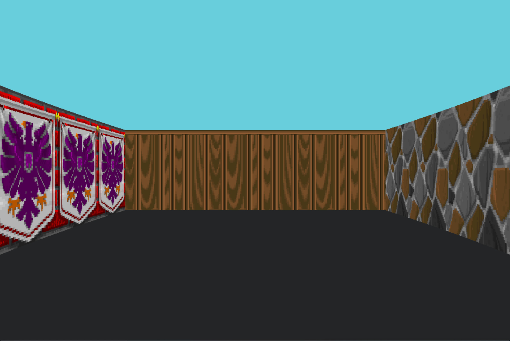
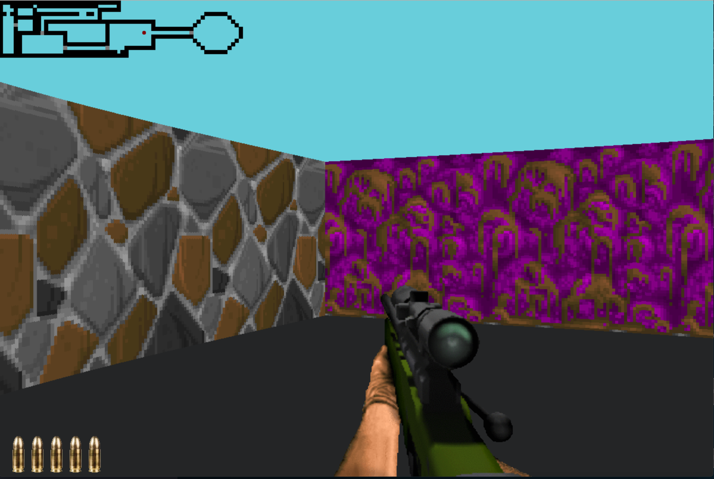
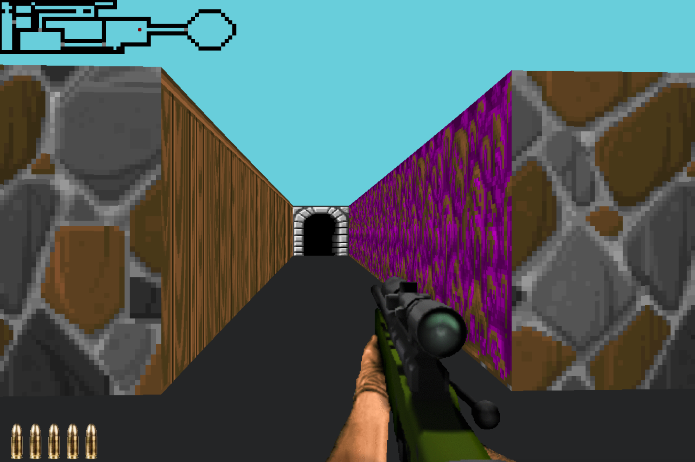

# Cub3d 

```
    This project is inspired by the world-famous eponymous 90's game,
    which was the first FPS ever,
    The Project Was Made to make Us explore Ray Casting,
    And It Was All About Making A Daynamic View Inside a Maze.
```


## Some Screen Shots From The Game

## Mandatory

</img>
## Bonus

</img>
</img>

